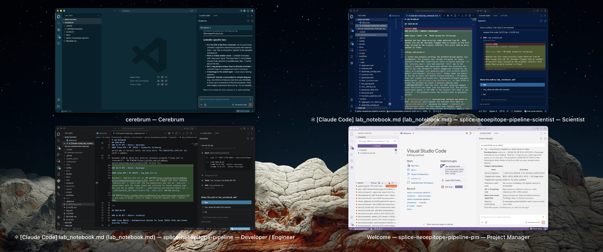

# claude-personas

**Lead your own AI team.** Role-aware persistent memory for solo multi-persona Claude Code workflows.



*A real setup: four roles working in parallel — `cerebrum` (shared memory), Scientist, Developer, and PM — each in its own VSCode window, each with its own `MEMORY.md`.*

---

## The problem

Claude Code auto-loads memory from `autoMemoryDirectory`. Great — until you start playing multiple roles on the same project. Coding Monday, triaging issues Tuesday, reviewing results Wednesday: your Developer Claude shouldn't have to wade through PM rules, and your PM Claude shouldn't inherit Developer habits. One memory directory mashes them all together.

You need a roster, not a single shared brain.

## What this gives you

Each persona or role on your team gets its own `MEMORY.md` — a playbook of habits, conventions, and rules tailored to that role. `claude-personas` is a **memory-only repo** — you clone it once and never use it as your project codebase. Your actual project repo stays separate. For each role you want active, you create a project worktree and point Claude at the matching persona folder inside `claude-personas`. Claude auto-loads the right playbook based on which worktree you opened.

A `shared/` folder (linked into every persona) holds team-wide conventions — things every role on your team should know. An `examples/` tree of ~25 real-world patterns is included if you want to crib plays from another team.

**For:** solo developers who lead multiple personas across git worktrees.
**Not for:** multi-human teams, agent-to-agent coordination, or automated memory capture.

## Quick start (~5 minutes)

1. Click **Use this template** → create your `claude-personas` repo (memory-only repo)
2. Clone it once, anywhere — one clone serves many project repos:
   `git clone git@github.com:<your-github-username>/claude-personas.git ~/projects/claude-personas`
3. For each role you want active, switch to your **project repo** (not claude-personas)
   and run these steps from there:
   - Create a project worktree for that role:
     `git worktree add ../my-app-pm -b pm/workspace`
   - Inside that project worktree, copy
     `<your-claude-personas-clone>/settings.local.json.example` →
     `.claude/settings.local.json`, with `autoMemoryDirectory` pointing at the matching
     role folder inside your claude-personas clone (e.g.
     `/Users/you/projects/claude-personas/pm`)
   - Inside that project worktree, copy
     `<your-claude-personas-clone>/CLAUDE.local.md.example` → `CLAUDE.local.md`, fill
     in the role label and the same absolute path, and add `CLAUDE.local.md` to your
     project repo's `.gitignore`
4. Open Claude Code in the project worktree → it auto-loads the right `MEMORY.md`
5. Browse `examples/` for patterns, copy what fits into your role's `feedback_*.md`
   files (then commit + push from your claude-personas clone to keep them durable)

## How it works

```text
claude-personas/                ← memory-only repo (clone once, reusable across projects)
├── shared/MEMORY.md            ← cross-role conventions (linked into every role)
├── developer/
│   ├── MEMORY.md               ← Developer-only rules
│   └── shared -> ../shared    ← symlink: reach shared as shared/feedback_X.md
├── pm/
│   ├── MEMORY.md               ← PM-only rules
│   └── shared -> ../shared
├── designer/
│   ├── MEMORY.md               ← Designer-only rules
│   └── shared -> ../shared
└── examples/                   ← ~25 sanitized real-world patterns, opt-in
    ├── shared/
    ├── developer/
    ├── pm/
    └── designer/

your-project/                   ← your actual codebase (separate repo)
├── .claude/settings.local.json ← autoMemoryDirectory → claude-personas/developer
└── CLAUDE.local.md             ← absolute path to claude-personas/developer

your-project-pm/                ← project worktree for PM role
├── .claude/settings.local.json ← autoMemoryDirectory → claude-personas/pm
└── CLAUDE.local.md             ← absolute path to claude-personas/pm
```

Each `MEMORY.md` has two sections:

- **Always in effect** — rules inlined directly; Claude reads these at session start with
  no file reads required
- **Reference** — links to `feedback_*.md` files Claude reads on demand

Rules start in Reference, get promoted to Always-in-effect when they keep being missed.
See `CONVENTIONS.md` for the full pattern.

## Per-project-worktree setup (one-time)

Each *project worktree* (not claude-personas itself) gets two files, both gitignored
in your project repo:

**`.claude/settings.local.json`** — copy from `claude-personas/settings.local.json.example`.
A single `autoMemoryDirectory` key pointing at the role folder inside claude-personas:

```json
{
  "autoMemoryDirectory": "/absolute/path/to/claude-personas/developer"
}
```

**`CLAUDE.local.md`** — copy from `claude-personas/CLAUDE.local.md.example`. Stores the
same absolute path in plain text so the role's `MEMORY.md` can instruct Claude to read
it. This solves a chicken-and-egg problem: the memory files use relative paths, but
Claude needs an absolute path to find them in the first place.

## Windows

Git symlinks require Developer Mode (Settings → Privacy & Security → Developer Mode). If
unavailable, create a `shared/` folder inside each role directory and copy shared files
there instead of symlinking.

## FAQ

**Q: Do I need all three roles?**
Delete any role you don't use. The remaining roles still work — the symlinks are independent.

**Q: Can I add more roles?**
Yes. Create a new folder, add a `MEMORY.md` stub, and create the symlink:
`(cd <role> && ln -s ../shared shared)`. Then create a project worktree for that role
and point its `autoMemoryDirectory` at the new folder.

**Q: How is this different from auto-memory?**
Auto-memory captures everything automatically. This is curated and hand-edited — you
decide what rules to keep and how to phrase them. Different tradeoff: more work, more
intentional.

**Q: What if I only want to start with one role for now?**
Skip git worktrees entirely. Put `.claude/settings.local.json` and `CLAUDE.local.md`
in your project's main directory, pointing at one role folder. You can add more roles
(and the worktrees they need) later without restructuring.

You *can* technically use this template with no role split at all — just to
version-control your memory files — but that's overkill. If you'll only ever want one
memory directory, a plain memory repo (no role folders, no symlinks) is simpler.

**Q: Does claude-personas need to be in the same parent directory as my project?**
No. claude-personas is referenced by absolute path; it can live anywhere. One
claude-personas clone can serve many different project repos.

## License

MIT
