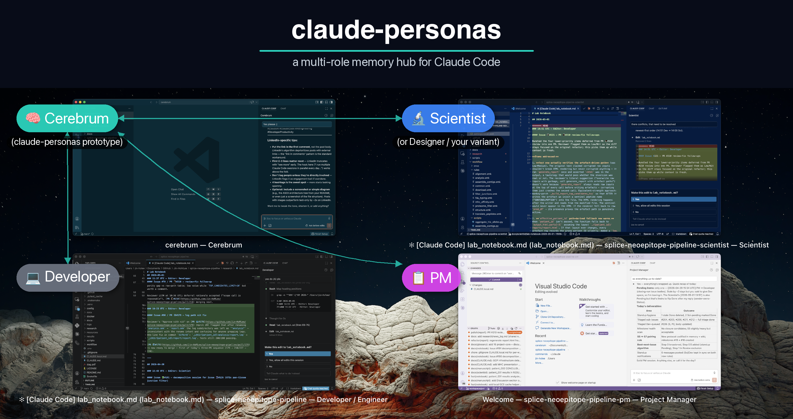

# claude-personas

[](https://github.com/Jin-HoMLee/claude-personas/actions/workflows/validate.yml)

**Lead your own AI team.** Role-aware persistent memory for solo multi-persona Claude Code workflows.



*A real setup: four roles working in parallel, each in its own VSCode window, each with its own `MEMORY.md`.*

---

## The problem

When you play multiple roles on a project (coding Monday, triaging Tuesday, reviewing Wednesday), you want Claude to behave differently in each context. Your Developer Claude shouldn't have to wade through PM rules, and your PM Claude shouldn't inherit Developer habits. One memory directory mashes them all together.

You need a roster, not a single shared brain.

## What this gives you

Each persona or role on your team gets its own `MEMORY.md` — a playbook of habits, conventions, and rules tailored to that role. `claude-personas` is a **memory-only repo** — you fork the template once per project and never use it as your project codebase. Your actual project repo stays separate.

For each role you want active, you create an independent **clone** of your project repo (sibling-dir style: `my-app/`, `my-app-pm/`, `my-app-scientist/`, ...). Each project clone has a `.claude/memory/` symlink into the matching role folder in your `claude-personas-<my-app>` repo. Claude auto-loads the right playbook based on which clone you open.

A `shared/` folder holds team-wide conventions. An `examples/` tree of patterns is included if you want to crib plays from another team.

**For:** solo developers who lead multiple personas across project clones.
**Not for:** multi-human teams, agent-to-agent coordination, or automated memory capture.

## Quick start (~10 minutes per project)

1. Click **Use this template** → create your `claude-personas-<my-app>` repo (one per project).
2. Clone the memory repo next to where you want your project clones:
   ```sh
   cd ~/dev
   git clone git@github.com:<you>/claude-personas-<my-app>.git
   ```
3. Run `init-clone.sh` once per role you want active:
   ```sh
   cd claude-personas-<my-app>
   ./scripts/init-clone.sh developer --project-url git@github.com:<you>/<my-app>.git
   ./scripts/init-clone.sh pm
   ./scripts/init-clone.sh designer
   ./scripts/init-clone.sh scientist
   ```
   First call persists the project URL — subsequent calls don't need `--project-url`.
4. Open any role's clone (e.g. `~/dev/my-app-pm/`) in Claude Code → role's MEMORY.md auto-loads via `.claude/memory/MEMORY.md`.
5. Browse `examples/` for patterns; copy what fits into your role's `feedback_*.md` files (then commit + push from your memory repo).

**Default no-suffix slot:** `developer` claims the `<project>/` (no-suffix) path. Override with `--main` on another role or by writing the role name into `.claude-personas/main-role.txt`.

## How it works

```text
~/dev/                                       (parent dir; both repos are siblings here)
├── my-app/                                  (Developer clone — no suffix)
│   ├── .git/                                (real, full project repo)
│   ├── .claude/memory ─symlink─► ../../claude-personas-my-app/developer/
│   └── [project files...]
│
├── my-app-pm/                               (PM clone)
│   ├── .claude/memory ─symlink─► ../../claude-personas-my-app/pm/
│   └── [project files...]
│
├── my-app-designer/                         (Designer clone — same shape)
├── my-app-scientist/                        (Scientist clone — same shape)
│
└── claude-personas-my-app/                  (memory repo, your fork of the template)
    ├── developer/
    │   ├── MEMORY.md
    │   └── shared ─symlink─► ../shared
    ├── pm/         (same shape)
    ├── designer/   (same shape)
    ├── scientist/  (same shape)
    ├── shared/                              (canonical shared layer)
    │   └── MEMORY.md
    ├── examples/   (cribbable patterns)
    └── scripts/    init-clone.sh, list-roles.sh
```

When you open `my-app-pm/` in Claude Code, the auto-memory loader reads `my-app-pm/.claude/memory/MEMORY.md` — which resolves through the symlink to `claude-personas-my-app/pm/MEMORY.md`. References to `.claude/memory/shared/MEMORY.md` resolve through a second symlink (`pm/shared -> ../shared`) to the canonical shared layer.

Two layers of symlinks; both invisible to Claude Code.

Each `MEMORY.md` has two sections:

- **Always in effect** — rules inlined directly; Claude reads these at session start with no file reads required.
- **Reference** — links to `feedback_*.md` files Claude reads on demand.

Rules start in Reference and get promoted to Always-in-effect when they keep being missed — unless a hook or skill fits the rule better. See [`CONVENTIONS.md`](CONVENTIONS.md) for the full four-tier ladder (Always-in-effect / Reference / Skills / Hooks).

## What `init-clone.sh` does (one-time per role)

For each role, the script:

1. Validates the role exists in the memory repo (`<role>/MEMORY.md` present).
2. Resolves the project URL: `--project-url` flag > `.claude-personas/project.txt` > prompt.
3. Decides the target clone path:
   - If `--main` or the role matches `.claude-personas/main-role.txt` (default `developer`), claims `<parent>/<project-name>/`.
   - Otherwise, target is `<parent>/<project-name>-<role>/`.
   - Falls through to suffixed path if the no-suffix path is taken.
4. `git clone <url> <target>`.
5. Creates the `.claude/memory/` symlink in the new clone pointing into `<memory-repo>/<role>`.
6. Adds `.claude/memory/` to the clone's `.gitignore` (idempotent).
7. On first run, persists the project URL to `.claude-personas/project.txt`.

**Audit:** run `./scripts/list-roles.sh` from inside your memory repo to see which clones exist, which are wired correctly, and which need fixing.

## Windows

Symlink creation needs Developer Mode on Windows (Settings → Privacy & Security → Developer Mode). If Developer Mode isn't an option in your environment, use WSL.

## FAQ

**Q: Do I need all four roles?**
No. Skip roles you don't use. Each `init-clone.sh` call is independent. The role dirs you don't run still ship in your fork's memory repo — delete them if you want.

**Q: Can I add custom roles?**
Yes. Create a new folder in your memory repo (e.g. `mlops/`), add a `MEMORY.md` + `shared -> ../shared` symlink, then `init-clone.sh mlops`.

**Q: How is this different from auto-memory (and Dreaming)?**
Three layers that are easy to conflate:

- **Auto-memory** — Claude Code captures notes automatically as you work. Machine-local, append-mostly, and (by design) noisy.
- **Dreaming** — Anthropic's memory-*consolidation* capability (currently a research preview on the Managed Agents API): it reads a memory store and produces a cleaned one — duplicates merged, stale or contradicted entries replaced, new patterns surfaced.
- **claude-personas** — the *curated, hand-edited, version-controlled* layer. You decide which rules to keep, how to phrase them, and — the part neither of the above touches — **which visibility tier each rule belongs in**: always-loaded, reference, skill, or hook (the four primitives; see [`CONVENTIONS.md`](CONVENTIONS.md)).

These are complementary, not competing: consolidation keeps whatever's in your store clean, but it doesn't decide what belongs there in the first place — that's what choosing a tier does. Auto-memory is automatic-but-noisy; this is more work, more intentional, and shareable across the roles on your team.

**Q: Disk cost?**
Each project clone is a full `git clone` — for most projects, ~few hundred MB. Today's machines have terabytes; disk is no longer a concern for the typical solo developer.

**Q: What if I move the memory repo after init?**
The `.claude/memory/` symlinks become broken. Re-run `init-clone.sh <role> --force` for each affected clone, OR manually re-point the symlink with `ln -sf ../../<new-path>/<role> <clone>/.claude/memory`.

**Q: Multiple projects?**
Each project needs its own memory repo (`claude-personas-<app1>`, `claude-personas-<app2>`, ...). Memory content and conventions are project-specific anyway.

## Upgrading from v2

See [`MIGRATION.md`](MIGRATION.md) for a six-step walkthrough. Takes ~10 minutes per project.

**Why v3?** v2's mechanism (git worktrees + hash-derived symlinks) silently broke under Claude Code v2.1.49+ — that release collapses all worktrees into a single hash dir, so v2's per-worktree symlinks never load. v3 uses real independent clones, which each get their own native auto-memory dir.

Users on Claude Code <v2.1.49 can pin their memory repo to the `v2-final` git tag.

## License

[MIT](LICENSE)
